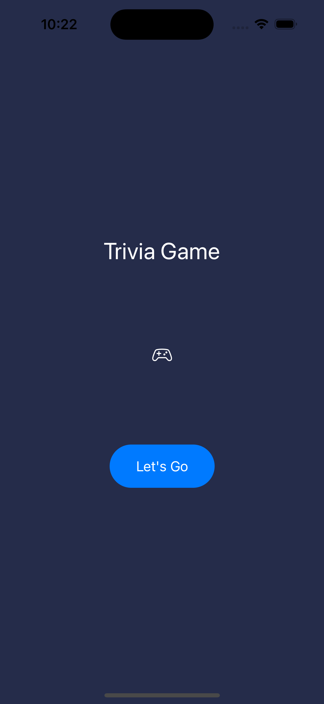
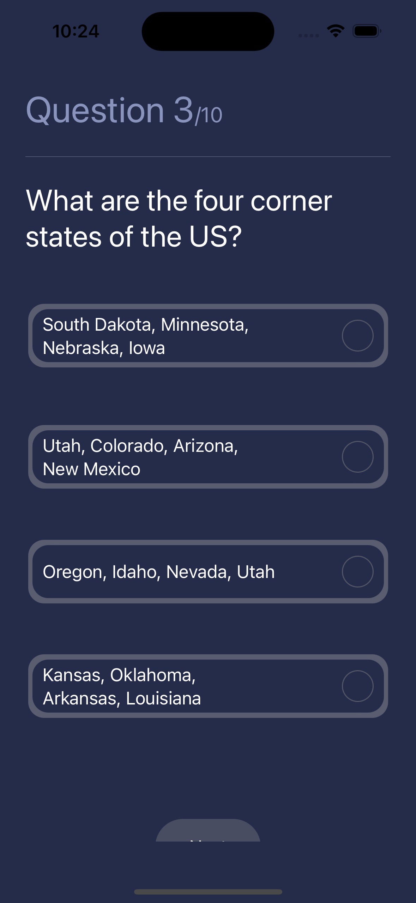
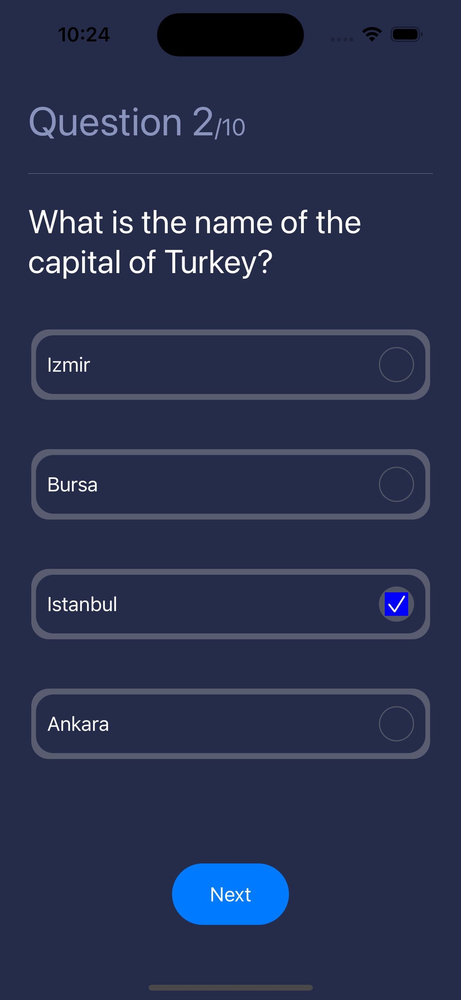
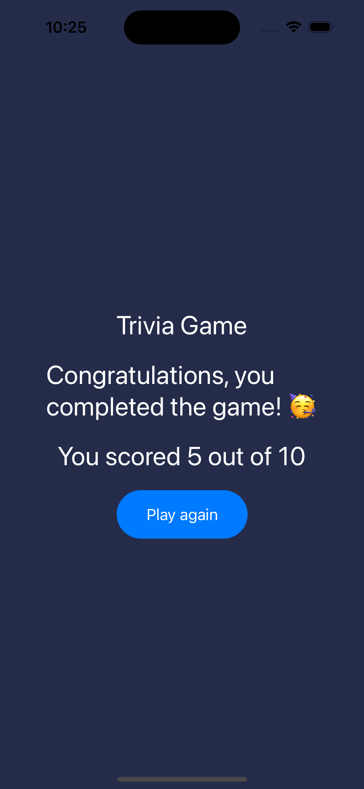

# Trivia game 
I built Trivia game using SwiftUI
#### Functionalities
* Fetch questions and answer choices from https://opentdb.com/api.php?amount=10
* Disabled next button enabled until you choose an answer
* Try again new trivia 
* Used MVVM

  

#### Screenshots

<table>

<tr>
 <td style="text-align: center, width: 180">
    
     Welcome
  </td>

   <td style="text-align: center, width: 180">
   
   Questions before selecting choice
  </td>

  <td style="text-align: center, width: 180">
    
   Questions after selecting choice
  </td>
</tr>

<tr>
 <td style="text-align: center, width: 180">
    
   Congrats view
  </td>
</tr>

</table>

